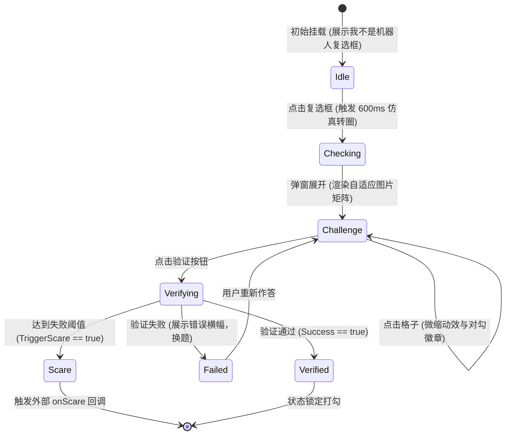

# Gotcha-CAPTCHA 架构与技术实现白皮书

> **版本**：v1.1.0  
> **协议**：GNU General Public License v3.0  
> **核心定位**：高拟真、组件化、跨长宽矩阵与双模式的整蛊伪装验证码（Prank CAPTCHA）开发框架。

---

## 目录

1. [项目概述与设计理念](#1-项目概述与设计理念)
2. [Monorepo 架构与拓扑结构](#2-monorepo-架构与拓扑结构)
3. [通用框架层深度解析 (packages)](#3-通用框架层深度解析-packages)
   - [3.1 gotcha-go 核心题库与校验引擎](#31-gotcha-go-核心题库与校验引擎)
   - [3.2 gotcha-react 高拟真伪装组件库](#32-gotcha-react-高拟真伪装组件库)
4. [业务演示层深度解析 (apps/touhou-boo)](#4-业务演示层深度解析-appstouhou-boo)
   - [4.1 业务背景与整蛊机制](#41-业务背景与整蛊机制)
   - [4.2 后端服务实现与 API 规范](#42-后端服务实现与-api-规范)
   - [4.3 前端场景集成与 KogasaScare 惊吓组件](#43-前端场景集成与-kogasascare-惊吓组件)
5. [题库设计规范与出题模式指南](#5-题库设计规范与出题模式指南)
   - [5.1 候选池随机抽选模式 (random_pool)](#51-候选池随机抽选模式-random_pool)
   - [5.2 全位置指定固定模式 (fixed_layout)](#52-全位置指定固定模式-fixed_layout)
6. [安全性与反作弊机制](#6-安全性与反作弊机制)
7. [测试、构建与运维部署](#7-测试构建与运维部署)

---

## 1. 项目概述与设计理念

传统人机验证（CAPTCHA）旨在拦截自动化爬虫与脚本，其严格的交互模式使得互联网用户对其具备天然的信任与顺从心理。**Gotcha-CAPTCHA** 逆向利用此心理契约，构建了一套外观、动效、交互反馈皆高度还原 Google reCAPTCHA v2 的伪装验证码框架，用于安全演练、防恶作剧意识培训与娱乐整蛊。

### 核心设计原则

1. **高拟真伪装 (Pixel-Perfect Camouflage)**：
   - 从 304×78px 经典锚点复选框、思考转圈动效，到 #1a73e8 Google 蓝横幅、九宫格微缩交互，在视觉与交互反馈上不留破绽。
2. **内核与业务绝对解耦 (Separation of Concerns)**：
   - 框架层（`packages/`）保持纯净无业务污染，可作为独立包发布至 npm 与 Go 模块仓库；
   - 业务层（`apps/`）专注具体主题落地（如东方 Project 的“多多良小伞整蛊网站”）。
3. **任意长宽矩阵支持 (Dynamic $Rows \times Columns$)**：
   - 突破固定 3×3 局限，支持 4×4、2×3、3×4 等任意非对称图片矩阵，前端 Grid 与容器自适应缩放。
4. **双出题模式架构 (Dual Challenge Modes)**：
   - **候选池随机抽取 (`random_pool`)**：数学上保障至少包含 1 张正确图片，干扰项动态填充，全局洗牌乱序；
   - **全位置固定指定 (`fixed_layout`)**：单元格坐标完全静态映射，支持拼图切割与剧情编排。
5. **数据敏感隔离 (Zero-Trust Client Desensitization)**：
   - 正确性标记（`IsTarget`）仅存留在服务端内存中，通过会话级映射下发脱敏数据，彻底杜绝“审查元素”作弊。

---

## 2. Monorepo 架构与拓扑结构

项目采用全栈 Monorepo 体系，后端通过 Go 1.24+ `go.work` 关联多模块，前端通过 npm workspaces 实现跨包本地符号链接依赖。

```text
gotcha-captcha/                      # 项目根目录 (Monorepo)
├── README.md                        # 框架总说明
├── TECHNICAL_DOCUMENTATION.md       # 本技术文档
├── go.work                          # Go 多模块工作区配置
├── package.json                     # 前端 npm workspaces 配置
│
├── packages/                        # 📦 通用框架层 (完全独立，无特定业务逻辑)
│   ├── gotcha-react/                # 纯净 React 伪装组件库
│   │   ├── package.json             # npm 包配置 (peerDependencies: react, react-dom)
│   │   ├── index.js                 # 统一导出入口
│   │   └── src/
│   │       ├── FakeCaptcha.jsx      # 核心组件 (状态机、自适应矩阵、勾选逻辑)
│   │       └── style.css            # 高拟真 Google reCAPTCHA 样式表
│   │
│   └── gotcha-go/                   # 纯净 Go 校验与题库引擎 (Go Module)
│       ├── go.mod                   # 模块名：github.com/jin-cpp/gotcha-captcha/packages/gotcha-go
│       ├── models.go                # 核心数据模型 (Tile, Challenge, VerifyResult 等)
│       ├── engine.go                # 题库装载、随机抽样洗牌算法、Session 会话管理
│       ├── verifier.go              # 答卷比对判定、失败累加与阈值熔断
│       └── engine_test.go           # 核心引擎单元测试 (覆盖率验证)
│
└── apps/                            # 🚀 业务应用层
    └── touhou-boo/                  # 多多良小伞整蛊网站演示
        ├── README.md                # 专属说明与作案动机故事
        ├── config.json              # 业务参数配置 (max_fails_to_scare: 3 等)
        ├── backend/                 # 服务端应用 (Go HTTP 服务)
        │   ├── go.mod               # 依赖本地 gotcha-go 模块
        │   ├── main.go              # 路由注册、CORS 中间件、静态资源托管
        │   └── data/
        │       ├── challenges/      # 东方题库 JSON (含 3x3 随机池与 4x4 固定阵列)
        │       └── assets/          # 纯矢量 SVG 题库图片 (灵梦/魔理沙/小伞等)
        └── frontend/                # 客户端应用 (React 19 + Vite 6)
            ├── package.json         # 依赖本地 gotcha-react
            ├── vite.config.js       # Vite 反向代理与插件配置
            ├── index.html           # SPA 入口页面
            ├── public/
            │   ├── favicon.ico      # 网站图标
            │   ├── kogasa_scare.svg # 高清小伞异色瞳与大舌头矢量大图
            │   └── urameshiya.mp3   # 小伞经典惊吓音效 (44.1kHz MP3)
            └── src/
                ├── App.jsx          # 博丽神社塞钱箱门禁主页面
                ├── components/
                │   └── KogasaScare.jsx # 碎屏、全屏震颤与台词对话框组件
                └── App.css          # 神社主题个性化样式与动画关键帧
```

---

## 3. 通用框架层深度解析 (packages)

### 3.1 gotcha-go 核心题库与校验引擎

`packages/gotcha-go` 实现了无状态题库模板与有状态受试者会话之间的分离。

#### 数据模型设计 (`models.go`)

```go
// ChallengeMode 定义出题模式
type ChallengeMode string

const (
    ModeRandomPool  ChallengeMode = "random_pool"  // 候选池随机抽样模式
    ModeFixedLayout ChallengeMode = "fixed_layout" // 全位置指定固定模式
)

// Tile 服务端完整方块结构（含 IsTarget 敏感答案字段）
type Tile struct {
    ID       string `json:"id"`
    ImageURL string `json:"imageUrl"`
    IsTarget bool   `json:"isTarget,omitempty"`
}

// ClientTile 客户端脱敏方块结构（移除 IsTarget）
type ClientTile struct {
    ID       string `json:"id"`
    ImageURL string `json:"imageUrl"`
}

// Challenge 题库持久化题目模板
type Challenge struct {
    ID             string        `json:"id"`
    Mode           ChallengeMode `json:"mode"`
    Rows           int           `json:"rows"`
    Columns        int           `json:"columns"`
    Title          string        `json:"title"`
    Target         string        `json:"target"`
    Instruction    string        `json:"instruction"`
    MinTargets     int           `json:"minTargets,omitempty"`
    MaxTargets     int           `json:"maxTargets,omitempty"`
    TargetPool     []Tile        `json:"targetPool,omitempty"`
    DistractorPool []Tile        `json:"distractorPool,omitempty"`
    Pool           []Tile        `json:"pool,omitempty"`
    FixedTiles     []Tile        `json:"fixedTiles,omitempty"`
    Tiles          []Tile        `json:"tiles,omitempty"`
}

// ClientChallenge 下发给前端渲染的挑战载荷
type ClientChallenge struct {
    ID          string        `json:"id"`
    SessionID   string        `json:"sessionId"`
    Mode        ChallengeMode `json:"mode"`
    Rows        int           `json:"rows"`
    Columns     int           `json:"columns"`
    Title       string        `json:"title"`
    Target      string        `json:"target"`
    Instruction string        `json:"instruction"`
    Tiles       []ClientTile  `json:"tiles"` // 长度严格等于 Rows * Columns
}
```

#### 引擎核心机制 (`engine.go`)

`Engine` 结构体包含：
- `challenges map[string]Challenge`：只读题目模板表；
- `sessions map[string]*SessionState`：会话状态表（记录每个会话的 `ActiveChallengeID`、`CorrectTileIDs map[string]bool` 与 `FailCount`）；
- `mu sync.RWMutex`：全局并发读写互斥锁，保证高并发访问时的内存安全。

```mermaid
flowchart TD
    A[调用 GenerateChallenge] --> B{解析 Mode}
    B -->|fixed_layout| C[读取 FixedTiles 列表]
    C --> D[校验数量是否等于 Rows * Columns]
    D --> E[保持坐标顺序，建立答案映射]
    
    B -->|random_pool| F[汇总 TargetPool 与 DistractorPool]
    F --> G[校验 Target 数量 >= 1]
    G --> H[计算抽样目标数 K: minK <= K <= maxK]
    H --> I[抽选 K 个目标 + N-K 个干扰项]
    I --> J[执行 Fisher-Yates 全局乱序洗牌]
    J --> K[分配唯一会话槽位 ID: {id}_pos{idx}]
    
    E --> L[生成 ClientTile 脱敏列表]
    K --> L
    L --> M[更新 SessionState 状态]
    M --> N[返回 ClientChallenge 响应]
```

##### 抽样算法数学保证
在 `random_pool` 模式下：
1. 保证目标数 $K \ge \max(1, MinTargets)$；
2. 若存在干扰项且 $N = Rows \times Columns > 1$，则目标数上限 $K \le \min(len(targets), N - 1)$，保证必然留有至少 1 个干扰项，避免整版全对失去验证意义；
3. 洗牌算法采用经典的 Fisher-Yates 算法，随机源使用底层加密安全的 `crypto/rand`：
   $$\forall i \in [N-1, 1], \quad j \leftarrow \text{UniformRandom}(0, i), \quad \text{Swap}(A[i], A[j])$$
   确保每个排列出现的概率严格为 $\frac{1}{N!}$。

##### 无重复题目滑动出题队列机制 (Non-repeating Challenge Queue)
为防止连续刷新或验证失败换题时连续出现相同题目模板，引擎在装载与出题阶段引入了防重复滑动队列：
1. **队列长度定义**：
   维护一个长度严格为 $L = \min\{\text{MinNoRepeatCount}, \text{题库总数}\}$ 的题目队列，队列内部元素互不重复。
2. **出队与随机入队流程**：
   - 每次出题，取队头题目 `head` 并将其出队；
   - 统计当前仍在队列中的题目集合 $Q_{\text{rem}}$；
   - 计算不在队列中的候选题目集合 $C = \{ c \in \text{AllChallenges} \mid c \notin Q_{\text{rem}} \}$；
   - 使用 `crypto/rand` 从集合 $C$ 中均匀随机抽取一道题目入队补齐至长度 $L$；
   - 返回 `head` 作为本次使用的题目模板。
3. **数学防重复保证**：
   - 任意一道题目被抽中出队后，即便立即被选为新入队候选，也位于队尾，前方有 $L - 1$ 道其他题目排队；
   - 故任何题目在后续连续 $L$ 次抽取中**绝对不会重复出现**；
   - 当配置的 $\text{MinNoRepeatCount} \ge \text{题库总数}$ 时，自动降级为全题库周期的轮转洗牌，保证所有题目依次出现。

#### 答卷校验引擎 (`verifier.go`)

`Verify(req VerifyRequest)` 执行答案判定：
1. **防篡改比对**：
   - 检查提交的 `SelectedIDs` 中是否包含所有 `session.CorrectTileIDs`；
   - 检查 `SelectedIDs` 中是否包含任何非目标 ID；
   - 必须满足充要条件：$\text{SelectedSet} \equiv \text{TargetSet}$。
2. **失败计数与整蛊触发**：
   - 正确：重置 `FailCount = 0`，返回 `Success: true`；
   - 错误：`FailCount++`；
   - 判定 `FailCount >= MaxFailsToScare`：若满足，触发 `TriggerScare = true`，并在本次响应后重置 `FailCount = 0`；若未满足，自动调用 `GenerateChallenge` 为该用户刷新下一道打乱题目挂载到 `NextChallenge` 返回。

---

### 3.2 gotcha-react 高拟真伪装组件库

`packages/gotcha-react` 导出的 `FakeCaptcha` 组件承担了前端欺诈呈现的核心交互。

#### 内部状态机模型



#### 动态矩阵 Grid 与弹性视口适配

组件根据服务端下发的 `columns` 动态注入 CSS Grid 样式：
```jsx
<div
  className="gotcha-grid"
  style={{
    gridTemplateColumns: `repeat(${challenge.columns || 3}, 1fr)`,
  }}
>
```
同时依据列数动态计算弹窗尺寸，确保在 2 列、3 列、4 列甚至更多列情况下，方块比例（`aspect-ratio: 1 / 1`）与外层弹窗（`popupWidth = clamp(cols * 115 + 40, 320, 560)`）均保持完美居中展示。

---

## 4. 业务演示层深度解析 (apps/touhou-boo)

### 4.1 业务背景与整蛊机制

“多多良小伞”是东方 Project 中由长柄唐伞化成的附丧神妖怪，生平最大志向是吓唬人类。面对现代人对传统妖怪见怪不怪的困境，小伞在人类村落通往博丽神社的“香油钱通道”上设卡，将自己伪装成 Google 验证码。人类在连续点错 3 次后，小伞便伴随着碎屏与「恨めしや〜！」破屏而出。

### 4.2 后端服务实现与 API 规范

后端入口位于 `apps/touhou-boo/backend/main.go`，内置 CORS 预检支持与静态文件服务器。

#### API 接口契约

| 端点 | 方法 | 说明 | 请求参数 | 响应示例 |
| :--- | :--- | :--- | :--- | :--- |
| `/api/config` | `GET` | 获取业务参数 | 无 | `{"app_name":"touhou-boo","max_fails_to_scare":3,"min_no_repeat_count":2,...}` |
| `/api/challenge` | `GET` | 生成/刷新题目 | `sessionId` (可选) | `{"id":"reimu_detection","rows":3,"columns":3,"tiles":[...]}` |
| `/api/verify` | `POST` | 校验提交答案 | JSON Payload | `{"success":false,"failCount":1,"triggerScare":false,"nextChallenge":{...}}` |
| `/assets/*` | `GET` | 静态题库矢量素材 | URL 路径 | SVG / PNG 图像文件流 |

##### POST `/api/verify` 请求 Payload 规范
```json
{
  "challengeId": "reimu_detection",
  "sessionId": "4b68e9f801ad23bc45e7890123456789",
  "selectedIds": [
    "reimu_1_pos0",
    "reimu_3_pos5"
  ]
}
```

##### POST `/api/verify` 触发整蛊时的响应 Payload
```json
{
  "success": false,
  "message": "已达到连续失败上限 (3 次)，触发整蛊惩罚！",
  "failCount": 3,
  "triggerScare": true
}
```

---

### 4.3 前端场景集成与 KogasaScare 惊吓组件

在 `apps/touhou-boo/frontend/src/components/KogasaScare.jsx` 中实现了极具视觉冲击力的整蛊视效：

1. **音频立体声突袭**：组件挂载后瞬间唤起 `/urameshiya.mp3`（44.1kHz 立体声采样，经 ffmpeg 合成的高亮颤音与回声）；捕获浏览器 `NotAllowedError` 异常，避免因未产生用户手势导致的静默崩坏。
2. **全局视口剧烈震颤 (`@keyframes shake`)**：直接在 `document.body` 挂载 `screen-shaking` 样式，以 0.15s 高频执行三维倾斜扭曲（$\pm 8px, \pm 1.5^\circ$）。
3. **警报红光频闪 (`.kogasa-flash`)**：覆盖半透明高频红色闪烁遮罩（`animation: flashStrobe 0.1s infinite alternate`）。
4. **SVG 物理碎屏裂纹 (`.kogasa-glass-crack`)**：全屏矢量裂纹网，呈现蛛网状受击碎裂质感。
5. **角色突进弹框**：多层次贝塞尔曲线动画（`cubic-bezier(0.175, 0.885, 0.32, 1.275)`）将小伞大图从中心猛烈推至屏幕前，附带经典对话框。

---

## 5. 题库设计规范与出题模式指南

所有题目保存在 `apps/touhou-boo/backend/data/challenges/*.json`。

### 5.1 候选池随机抽选模式 (`random_pool`)

适用于“从多张备选项中找出所有 X 角色/物品”的经典题型。服务端保证每次随机生成的题目中**至少有 1 张正确图片**。

#### 示例配置：`reimu_detection.json`
```json
{
  "id": "reimu_detection",
  "mode": "random_pool",
  "rows": 3,
  "columns": 3,
  "title": "选择所有包含以下内容的方块",
  "target": "博丽灵梦 (Hakurei Reimu)",
  "instruction": "请选出所有博丽神社巫女。如果不确定，请注意红色大蝴蝶结与巫女服。",
  "minTargets": 1,
  "maxTargets": 4,
  "targetPool": [
    { "id": "reimu_1", "imageUrl": "/assets/reimu.svg", "isTarget": true },
    { "id": "reimu_2", "imageUrl": "/assets/reimu.svg", "isTarget": true },
    { "id": "reimu_3", "imageUrl": "/assets/reimu.svg", "isTarget": true }
  ],
  "distractorPool": [
    { "id": "marisa_1", "imageUrl": "/assets/marisa.svg", "isTarget": false },
    { "id": "sanae_1", "imageUrl": "/assets/sanae.svg", "isTarget": false },
    { "id": "cirno_1", "imageUrl": "/assets/cirno.svg", "isTarget": false },
    { "id": "kogasa_1", "imageUrl": "/assets/kogasa.svg", "isTarget": false },
    { "id": "youmu_1", "imageUrl": "/assets/youmu.svg", "isTarget": false }
  ]
}
```

### 5.2 全位置指定固定模式 (`fixed_layout`)

适用于“大图切片拼图（Sliced Puzzle）”或“指定位置雷达监控”，矩阵每个坐标的图片与答案完全固定，**不进行洗牌乱序**。

#### 示例配置：`kogasa_fixed_4x4.json` (4×4 阵列)
```json
{
  "id": "kogasa_fixed_4x4",
  "mode": "fixed_layout",
  "rows": 4,
  "columns": 4,
  "title": "选择所有包含以下内容的方块",
  "target": "潜伏在 4x4 阵列中的唐伞妖怪",
  "instruction": "在 4x4 的全位置监控方阵中，指定选出所有潜伏的小伞。",
  "fixedTiles": [
    { "id": "cell_0_0", "imageUrl": "/assets/umbrella_normal.svg", "isTarget": false },
    { "id": "cell_0_1", "imageUrl": "/assets/umbrella_normal.svg", "isTarget": false },
    { "id": "cell_0_2", "imageUrl": "/assets/kogasa.svg", "isTarget": true },
    { "id": "cell_0_3", "imageUrl": "/assets/umbrella_normal.svg", "isTarget": false },
    { "id": "cell_1_0", "imageUrl": "/assets/umbrella_normal.svg", "isTarget": false },
    { "id": "cell_1_1", "imageUrl": "/assets/kogasa.svg", "isTarget": true },
    { "id": "cell_1_2", "imageUrl": "/assets/umbrella_normal.svg", "isTarget": false },
    { "id": "cell_1_3", "imageUrl": "/assets/umbrella_normal.svg", "isTarget": false },
    { "id": "cell_2_0", "imageUrl": "/assets/reimu.svg", "isTarget": false },
    { "id": "cell_2_1", "imageUrl": "/assets/umbrella_normal.svg", "isTarget": false },
    { "id": "cell_2_2", "imageUrl": "/assets/umbrella_normal.svg", "isTarget": false },
    { "id": "cell_2_3", "imageUrl": "/assets/kogasa.svg", "isTarget": true },
    { "id": "cell_3_0", "imageUrl": "/assets/umbrella_normal.svg", "isTarget": false },
    { "id": "cell_3_1", "imageUrl": "/assets/kogasa.svg", "isTarget": true },
    { "id": "cell_3_2", "imageUrl": "/assets/umbrella_normal.svg", "isTarget": false },
    { "id": "cell_3_3", "imageUrl": "/assets/marisa.svg", "isTarget": false }
  ]
}
```

> **规则约束**：`fixed_layout` 模式下，`fixedTiles` 数组长度**必须严格等于** `rows * columns`，否则引擎启动或出题时将抛出类型校验异常。

---

## 6. 安全性与反作弊机制

为了保障整蛊效果，受试者往往会试图通过前端调试工具“作弊”，Gotcha-CAPTCHA 在架构层面部署了多重防御：

1. **响应脱敏过滤**：下发给浏览器的 `ClientChallenge` 绝对不包含 `isTarget` 属性。
2. **会话槽位唯一化动态混淆**：在 `random_pool` 模式下，即使抽取了同一张图片，服务端也会将其重新编码为 `reimu_1_pos0`、`reimu_1_pos3` 等唯一槽位标识，客户端无法通过静态 ID 猜测答案或复用历史解答。
3. **会话级题目绑定**：每次提交必须携带 `sessionId` 与 `challengeId`，服务端核验是否为当前会话活跃生成的未完结题目，防止并发竞态作弊。
4. **失败状态机服务端托管**：失败次数 `FailCount` 与整蛊触发判定完全在服务端内存中递增与判定，前端无法通过修改 LocalStorage 或全局变量篡改整蛊阈值。

---

## 7. 测试、构建与运维部署

### 7.1 本地测试

框架已编写严密的 Go 自动化单元测试：

```bash
# 运行 gotcha-go 引擎核心测试套件
go test -v -count=1 ./packages/gotcha-go/...
```

测试涵盖：
- `TestEngineVerificationAndScare`：失败计数累加与阈值熔断断言；
- `TestRandomPoolMode`：50 次随机压力抽查，断言每次生成的题目中正确图片数严格满足 $K \ge 1$；
- `TestFixedLayoutMode`：对 4×4 与 2×3 非对称矩阵进行坐标位置不失真与提交校验断言。

### 7.2 生产打包构建

```bash
# 1. 编译验证 Go 后端
go vet ./apps/touhou-boo/backend/...
go build -o ./apps/touhou-boo/backend/touhou-boo-server ./apps/touhou-boo/backend/main.go

# 2. 构建前端单页应用
npm run build
```

前端构建产物将输出至 `apps/touhou-boo/frontend/dist/`，可直接通过 Nginx 托管或由 Go 后端作为静态文件挂载。

---

## 8. 总结与展望

**Gotcha-CAPTCHA** 成功将现代 Web 前端拟真工程与高并发 Go 服务端校验相结合，构建了一个解耦彻底、表现拟真、支持任意矩阵尺寸与双模式的整蛊验证码框架。未来可基于本白皮书规范扩展更多玩法（如限时消失方块、双重点击验证、音频逆向诱导等）。

